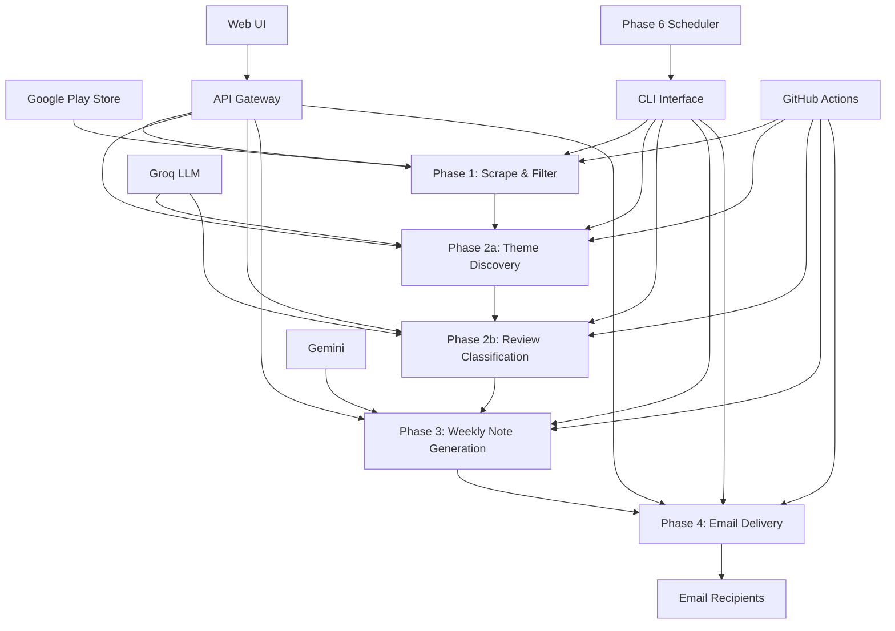
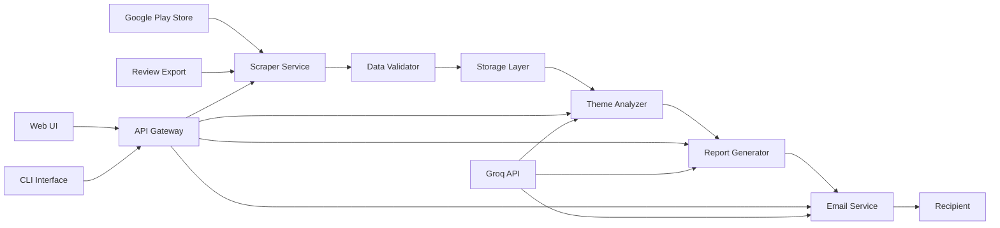
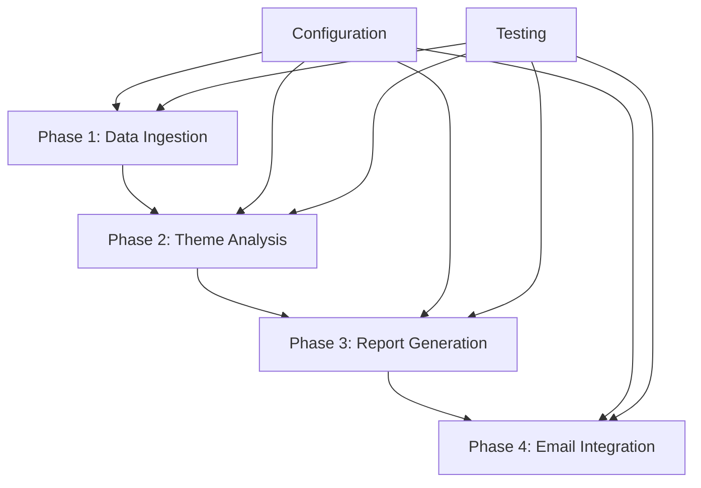

# App Review Insights Analyzer - Architecture Document

## Project Overview

Transform App Store/Play Store reviews into actionable weekly insights for product, growth, support, and leadership teams.

## Deployment & URLs

| Service | URL | Description |
|---------|-----|-------------|
| **Frontend (Vercel)** | https://app-review-insights-analyser.vercel.app | Web UI (Run Pipeline, View Report, Send Email) |
| **Backend (Render)** | https://app-review-insights-analyser.onrender.com | FastAPI REST API (Docker) |
| **API Base** | https://app-review-insights-analyser.onrender.com/api | REST endpoints (status, run, report, email) |
| **Resend** | https://resend.com | Email delivery (API, used on Render free tier) |
| **GitHub Gist** | https://gist.github.com | Report storage for View Report on Render free tier (no persistent disk) |
| **GitHub Actions** | .github/workflows/weekly-pulse.yml | Scheduler: Sunday 9:00 AM IST |

**Local:** http://localhost:8000 (Web UI + API via `python run_web.py`)

## Tech Stack

| Layer | Technology |
|-------|------------|
| **Backend** | Python 3.10/3.11, FastAPI, Uvicorn |
| **Frontend** | Static HTML/CSS/JS, vanilla JS (no framework) |
| **AI/LLM** | Groq (theme discovery, classification), Google Gemini (weekly note generation) |
| **Email** | Resend API (Render) or SMTP (local) |
| **Scraping** | google-play-scraper |
| **Hosting** | Render.com (backend), Vercel (frontend) |
| **Scheduler** | GitHub Actions (cron: Sunday 9:00 AM IST) |
| **Report Storage** | GitHub Gist (persistent, free; Render free tier has ephemeral disk) |

### Problem Statement
Turn recent App Store/ Play Store reviews into a one-page weekly pulse containing:
- Top themes
- Real user quotes  
- Three action ideas
- Draft email containing the weekly note

### Key Constraints
- Use google-play-scraper for downloading reviews and public exports
- Max 5 themes per report
- Keep notes scannable, ≤400 words (updated from 250)
- No PII (usernames/emails/IDs) in any artifacts
- Use Groq LLM for theme analysis and classification
- Use Gemini for weekly note generation
- Support both CLI and UI interfaces
- Focus on INDMoney app (in.indwealth)
- Reviews with fewer than 10 words are excluded
- Store only reviewId, rating, text, date (no title)

## Phase-wise Organization

The codebase is organized into separate phases for better maintainability and modularity:

### Phase 1: Data Ingestion (`phase1/`)
- **Purpose**: Scrape and filter Google Play Store reviews for INDMoney
- **Key Components**:
  - `scraper_service.py`: Google Play Store integration
  - `data_ingestion.py`: Review data orchestration
  - `utils/validators.py`: PII filtering and review validation
  - `models/review.py`: Review data models
- **Output**: `data/reviews/YYYY-MM-DD.json` (filtered reviews)

#### Data Cleaning Rules:
- **PII Removal**: Emails, phone numbers, usernames, IDs, URLs
- **Content Filters**: 
  - Reviews with <10 words excluded
  - Non-English reviews excluded
  - **Emojis and star rating icons (⭐★☆) removed**
  - Reviews older than specified weeks excluded
- **Storage Format**: JSON with reviewId, rating, text, date fields only

### Phase 2a: Theme Discovery (`phase2a/`)
- **Purpose**: Discover recurring themes from reviews using Groq LLM
- **Key Components**:
  - `groq_service.py`: Groq LLM integration
  - `theme_discovery.py`: Theme discovery orchestration
  - `models/theme.py`: Theme data models
  - `config/prompts.py`: LLM prompts for theme discovery
- **Output**: `data/reports/themes-YYYY-MM-DD.json` with discovered themes

### Phase 2b: Review Classification (`phase2b/`)
- **Purpose**: Classify individual reviews into discovered themes
- **Key Components**:
  - `classification_service.py`: Groq classification service
  - `review_classification.py`: Classification orchestration
  - `models/classification.py`: Classification data models
  - `config/classification_prompts.py`: Classification prompts
- **Output**: `data/reports/grouped_reviews-YYYY-MM-DD.json` with classified reviews

### Phase 3: Weekly Note Generation (`phase3/`)
- **Purpose**: Generate actionable weekly insights using Gemini LLM
- **Key Components**:
  - `gemini_service.py`: Gemini LLM integration
  - `note_generation.py`: Weekly note orchestration
  - `models/note.py`: Weekly note data models
  - `config/prompts.py`: Weekly note generation prompts
- **Output**: 
  - `data/reports/pulse-YYYY-MM-DD.md` (Markdown format)
  - `data/reports/pulse-YYYY-MM-DD.txt` (Plain text format)
  - `data/reports/weekly_pulse-YYYY-MM-DD.json` (Structured data)

### Phase 5: Orchestration & Web UI (`phase5/`)
- **Purpose**: Orchestrate the full pipeline (Phases 1–4), expose API for Web UI and CLI
- **Key Components**:
  - `pipeline.py`: End-to-end pipeline orchestration
  - `api.py`: FastAPI routes for Web UI
  - `static/`: Simple single-page web UI
- **Interfaces**:
  - **CLI**: `main.py --phase run` (existing)
  - **Web UI**: Minimal single-page interface with essential actions only
  - **API**: REST endpoints for run, status, report, send-email

#### Phase 5 Minimal UI Specification
- **One page only** — no multi-page navigation
- **Essential buttons only**:
  1. **Run Pipeline** — Triggers full pipeline (scrape → themes → classify → note → draft). Blocked if scheduler ran today (IST).
  2. **View Report** — Display latest weekly pulse from Gist or local data. Shows "Scheduler/Pipeline already ran today" when sync date is today.
  3. **Send Email** — Send latest report via Resend (deployed) or SMTP (local)
- **Checkbox:** "Use previous synced data" — run with mock data; View Report fetches from Gist when checked
- **Status panel** — Reviews, Themes, Scheduler Run, Synced Pipeline, Last Email Sent (all timestamps in IST)
- **Report preview** — Rendered markdown in a simple card
- **No** analytics, scheduling, or config UI (use CLI / .env)

### Phase 6: Scheduler (`phase6/`)
- **Purpose**: Run weekly pulse automatically every Sunday at 9:00 AM IST — **fetch data only** (Phases 1–3). **Email is sent from the UI**, not from the scheduler.
- **Scope**: **100 reviews, 8 weeks** (no 5000-review runs)
- **Key Components**:
  - `scheduler.py`: Runs CLI `main.py --phase run --skip-email --weeks 8 --count 100` (no email)
  - `daemon.py`: APScheduler daemon (9:00 AM IST, Sundays)
  - `config.py`: `SCHEDULED_WEEKS=8`, `SCHEDULED_COUNT=100`
- **Integration**:
  - **CLI**: `python -m phase6.scheduler` (one-shot) or `python -m phase6.daemon` (long-running)
  - **GitHub Actions**: `.github/workflows/weekly-pulse.yml` — cron `30 3 * * 0` (3:30 AM UTC = 9 AM IST, Sundays)
- **Required Secrets** (GitHub): `GROQ_API_KEY`, `GEMINI_API_KEY` (no email secrets; email from UI)

### Phase 4: Email Delivery (`phase4/`)
- **Purpose**: Deliver weekly insights via email with SMTP integration
- **Key Components**:
  - `email_service.py`: SMTP email service with TLS encryption
  - `email_delivery.py`: Email delivery orchestration
  - `models/email.py`: Email data models and validation
  - `config/email_templates.py`: Email templates and HTML formatting
  - `templates/`: Email template files
- **Output**:
  - `data/drafts/draft_YYYYMMDD_HHMMSS.eml` (Email drafts)
  - `data/deliveries/delivery_*.json` (Delivery records)
  - Sent emails via SMTP (when --send flag used)

### Benefits of Phase-wise Organization:
- **Modularity**: Each phase can be developed, tested, and maintained independently
- **Reusability**: Phase outputs can be used as inputs for multiple downstream processes
- **Scalability**: Individual phases can be scaled or optimized separately
- **Testing**: Each phase can be unit tested in isolation
- **Debugging**: Issues can be isolated to specific phases

### Phase Dependencies:
```
Phase 1 (Reviews) → Phase 2a (Themes) → Phase 2b (Classified Reviews) → Phase 3 (Weekly Notes) → Phase 4 (Email Delivery)
                                                                    ↑
Phase 5 (Orchestration + API + Web UI) invokes Phases 1–4 and serves the Web UI (email from UI)
Phase 6 (Scheduler) invokes CLI (Phases 1–3, --skip-email) at 9:00 AM IST weekly; GitHub Actions runs the same
```

Each phase depends on the output of the previous phase, creating a clear data pipeline.



## Phase-Wise Implementation

### Phase 1: Review Ingestion and Cleaning
**Objective**: Reliably get 8–12 weeks of Play Store reviews and store them in a PII-safe form

**Components**:
- Google Play Scraper Integration
- PII Filter Implementation
- Date Range Filtering
- Review Validation
- File Persistence

**Technical Stack**:
- Python 3.11+
- google-play-scraper for automated review collection
- JSON for storage
- Pydantic for data validation

**Configuration**:
- **Target App**: INDMoney
- **Package ID**: in.indwealth
- **Language**: lang="en", country="in"
- **Sort**: Sort.NEWEST, count=100 (scheduler), configurable via CLI `--count`
- **Weeks**: 8-12 (configurable)

**Key Features**:
- Fetch reviews using google-play-scraper
- Filter by date (keep only reviews >= today - weeks * 7 days)
- PII sanitization before storage
- Exclude reviews with fewer than 10 words
- Exclude reviews with emojis or non-English text
- Store only: reviewId, rating, text, date (no title)
- Write to data/reviews/YYYY-MM-DD.json format

**Output Format**:
```json
{
  "scrapedAt": "ISO8601",
  "packageId": "in.indwealth",
  "appId": "indmoney",
  "weeksRequested": 10,
  "reviews": [
    {
      "reviewId": "string",
      "rating": 1,
      "text": "string",
      "date": "ISO8601 datetime"
    }
  ]
}
```

### Phase 2: Theme Discovery and Classification (Groq)
**Objective**: Produce 3–5 themes and assign every review to exactly one theme

**Components**:
- Theme Discovery Engine (2a)
- Review Classification Engine (2b)
- Batch Processing Logic
- Rate Limiting and Retry

**Technical Stack**:
- Groq Python SDK
- llama-3.3-70b-versatile model
- Async processing for batch operations
- JSON parsing and validation

#### Phase 2a: Theme Discovery
**Input**: Sample of 100-150 reviews, stratified by rating
**Prompt**: "You are a product analyst. Given these user reviews for the INDMoney app, identify exactly 3 to 5 recurring themes. Return ONLY a JSON array of theme objects: [{\"id\": \"theme_slug\", \"label\": \"Human Label\", \"description\": \"one-line description\"}]."

**Output Format**:
```json
[
  {
    "id": "theme_slug",
    "label": "Human-Readable Theme Name",
    "description": "One-line description"
  }
]
```

#### Phase 2b: Review Classification
**Input**: Full list of reviews and theme list from 2a
**Batching**: Process reviews in chunks of ~50
**Prompt**: "Given these themes: {themes_json}. Classify each review below into exactly one theme. Return a JSON array: [{\"reviewId\": \"...\", \"theme_id\": \"...\"}]. Reviews: {batch}."

**Output Format**:
```json
{
  "generatedAt": "ISO8601",
  "themes": [
    {"id": "theme_slug", "label": "Human Label", "description": "one-line description"}
  ],
  "byTheme": {
    "theme_slug_1": [
      {"reviewId": "...", "rating": 1, "text": "...", "date": "..."}
    ],
    "theme_slug_2": [...]
  }
}
```

**Rate Limiting**: 0.5s sleep between Groq calls; retry with backoff on HTTP 429

### Phase 3: Weekly Note Generation (Gemini)
**Objective**: One-page, structured weekly pulse from grouped data

**Components**:
- Weekly Note Generator
- Quote Selection Algorithm
- Action Ideas Generator
- Content Validation

**Technical Stack**:
- Gemini API (gemini-1.5-flash)
- Markdown generation
- Text validation
- Substring verification

**Input**: grouped_reviews-*.json and report date
**Role**: "You are a product communications writer at INDMoney."
**Task**: "Using the themed review data below, write a concise Weekly Review Pulse note."

**Format**: Sections: Top Themes, Real User Quotes, Action Ideas
**Rules**: 
- No PII (use [User] for names)
- Quotes must be verbatim from provided reviews
- Under 400 words total
- Exactly 3 quotes (no star ratings or emoji in output, per PII/clean-output rules)
- Exactly 3 concrete, theme-linked actions

**Output Files**:
- data/reports/pulse-YYYY-MM-DD.md (Markdown)
- data/reports/pulse-YYYY-MM-DD.txt (Plain text)

**Structure**:
```markdown
## INDMoney Weekly Review Pulse -- Week of {date}

### Top Themes
[Top 3 themes with one-sentence summary and mention count]

### Real User Quotes
[Exactly 3 verbatim quotes, no star ratings]

### Action Ideas
[Exactly 3 concrete, theme-linked actions]
```

### Phase 4: Email Delivery
**Objective**: Produce a draft email (and optionally send it) containing the weekly note

**Components**:
- Email Service Integration
- Template Engine
- SMTP Configuration
- Dry-run Mode

**Technical Stack**:
- SMTP integration (smtplib)
- Markdown to HTML conversion
- Multipart email formatting
- TLS encryption

**Message Format**:
- **Subject**: INDMoney Weekly Review Pulse -- Week of {date}
- **From**: EMAIL_SENDER
- **To**: Runtime recipient or EMAIL_RECIPIENT
- **Body**: Multipart (plain + HTML)
- **Greeting**: "Hi {name}," when recipient name provided

**Modes**:
- **Dry-run (default)**: Write to data/reports/pulse-YYYY-MM-DD.eml
- **Send mode**: Send via SMTP when --send flag provided

**Configuration**:
- EMAIL_SENDER
- EMAIL_PASSWORD (Gmail App Password)
- SMTP_HOST, SMTP_PORT
- EMAIL_RECIPIENT (optional when runtime recipient provided)

## Detailed System Architecture

### Data Flow Architecture



### Component Architecture

#### 1. Data Layer
```
app-review-insights-analyser/
├── phase1/                          # Phase 1: Review Ingestion & Cleaning
│   ├── __init__.py
│   ├── scraper_service.py           # Google Play Store scraper
│   ├── data_ingestion.py             # Data processing & storage
│   ├── models/
│   │   ├── __init__.py
│   │   └── review.py                 # Review data models
│   └── utils/
│       ├── __init__.py
│       └── validators.py            # Review validation & PII filtering
├── phase2a/                         # Phase 2a: Theme Discovery
│   ├── __init__.py
│   ├── groq_service.py               # Groq LLM integration
│   ├── theme_discovery.py            # Theme discovery orchestration
│   ├── models/
│   │   ├── __init__.py
│   │   └── theme.py                  # Theme data models
│   └── config/
│       ├── __init__.py
│       └── prompts.py                # LLM prompts
├── phase2b/                         # Phase 2b: Review Classification
│   ├── __init__.py
│   ├── classification_service.py     # Groq classification service
│   ├── review_classification.py      # Classification orchestration
│   ├── models/
│   │   ├── __init__.py
│   │   └── classification.py         # Classification data models
│   └── config/
│       ├── __init__.py
│       └── classification_prompts.py # Classification prompts
├── phase3/                         # Phase 3: Weekly Note Generation
│   ├── __init__.py
│   ├── gemini_service.py             # Gemini LLM integration
│   ├── note_generation.py            # Weekly note orchestration
│   ├── models/
│   │   ├── __init__.py
│   │   └── note.py                   # Weekly note data models
│   └── config/
│       ├── __init__.py
│       └── prompts.py                # Weekly note generation prompts
├── phase5/                         # Phase 5: Orchestration & Web UI
│   ├── __init__.py
│   ├── pipeline.py                  # Pipeline orchestration
│   ├── api.py                       # FastAPI REST API
│   └── static/
│       └── index.html               # Minimal Web UI (single page)
├── phase4/                         # Phase 4: Email Delivery
│   ├── __init__.py
│   ├── email_service.py             # SMTP email service
│   ├── email_delivery.py            # Email delivery orchestration
│   ├── models/
│   │   ├── __init__.py
│   │   └── email.py                  # Email data models
│   ├── config/
│   │   ├── __init__.py
│   │   └── email_templates.py        # Email templates
│   └── templates/
│       └── __init__.py               # Email template files
├── src/                             # Shared components
│   └── config/
│       └── settings.py              # Configuration management
├── data/                            # Data storage
│   ├── reviews/                     # Raw reviews (Phase 1 output)
│   ├── reports/                     # Generated reports
│   │   ├── themes-*.json           # Discovered themes (Phase 2a)
│   │   ├── grouped_reviews-*.json # Classified reviews (Phase 2b)
│   │   ├── pulse-*.md              # Weekly notes (Phase 3, Markdown)
│   │   ├── pulse-*.txt              # Weekly notes (Phase 3, Plain text)
│   │   └── weekly_pulse-*.json     # Weekly notes (Phase 3, Structured)
│   ├── drafts/                      # Email drafts (Phase 4)
│   ├── deliveries/                  # Email delivery records (Phase 4)
│   └── logs/                        # Application logs
├── main.py                          # CLI entry point
├── requirements.txt                 # Python dependencies
├── .env.example                     # Environment variables template
└── ARCHITECTURE.md                  # This document
```

#### 2. Service Layer
```
src/
├── services/
│   ├── scraper_service.py      # Google Play scraper
│   ├── data_ingestion.py
│   ├── theme_analysis.py
│   ├── report_generation.py
│   ├── email_service.py
│   └── api_service.py          # FastAPI endpoints
├── ui/
│   ├── frontend/               # React.js application
│   │   ├── components/
│   │   ├── pages/
│   │   └── services/
│   └── static/
├── models/
│   ├── review.py
│   ├── theme.py
│   └── report.py
├── utils/
│   ├── validators.py
│   ├── formatters.py
│   └── pii_detector.py
├── cli/
│   └── commands.py            # CLI interface
└── config/
    ├── settings.py
    └── prompts.py
```

#### 3. Configuration Layer
```
config/
├── app_config.yaml
├── llm_prompts.yaml
├── email_templates.yaml
└── scraper_config.yaml      # Google Play scraper settings
```

#### 4. UI Layer
```
frontend/
├── src/
│   ├── components/
│   │   ├── Dashboard.jsx      # Main dashboard
│   │   ├── ReportGenerator.jsx # Report generation UI
│   │   ├── EmailComposer.jsx   # Email drafting UI
│   │   └── Settings.jsx        # Configuration UI
│   ├── pages/
│   │   ├── Home.jsx
│   │   ├── Reports.jsx        # Historical reports
│   │   └── Analytics.jsx      # Review analytics
│   ├── services/
│   │   └── api.js             # API client
│   └── utils/
├── public/
└── package.json
```

## Data Models and File Formats

### Review Record (Internal)
```json
{
  "reviewId": "string",
  "rating": 1,
  "text": "string",
  "date": "ISO8601 datetime"
}
```
- **reviewId**: From Play Store (used for deduplication and classification)
- **date**: Review's published date (used to restrict to 8-12 weeks)
- **text**: PII-sanitized review text
- **Exclusions**: Reviews with <10 words, with emoji, or non-English

### Reviews File (Phase 1 Output)
**Path**: data/reviews/YYYY-MM-DD.json
```json
{
  "scrapedAt": "ISO8601",
  "packageId": "in.indwealth",
  "appId": "indmoney",
  "weeksRequested": 10,
  "reviews": [
    {"reviewId", "rating", "text", "date"}
  ]
}
```

### Themes (Phase 2a Output)
```json
[
  {
    "id": "theme_slug",
    "label": "Human-Readable Theme Name",
    "description": "One-line description"
  }
]
```
- Exactly 3-5 themes per run
- **id**: machine-friendly slug for classification

### Grouped Reviews (Phase 2b Output)
**Path**: data/reports/grouped_reviews-YYYY-MM-DD.json
```json
{
  "generatedAt": "ISO8601",
  "appId": "indmoney",
  "packageId": "in.indwealth",
  "themes": [
    {"id", "label", "description"}
  ],
  "byTheme": {
    "theme_slug_1": [
      {"reviewId", "rating", "text", "date"}
    ],
    "theme_slug_2": [...]
  }
}
```

### Weekly Pulse Note (Phase 3 Output)
**Paths**: 
- data/reports/pulse-YYYY-MM-DD.md
- data/reports/pulse-YYYY-MM-DD.txt

**Structure**:
```markdown
## INDMoney Weekly Review Pulse -- Week of {date}

### Top Themes
Top 3 themes with one-sentence summary and mention count

### Real User Quotes
Exactly 3 verbatim quotes (with star rating); no PII

### Action Ideas
Exactly 3 concrete, theme-linked actions
```
- **Length**: Under 400 words
- **Quotes**: Must exist in provided reviews; no fabrication

### Theme Model
```python
class Theme:
    id: str                   # Theme identifier
    name: str                 # Theme name
    description: str          # Theme description
    review_count: int         # Number of reviews
    confidence_score: float   # AI confidence
    created_at: datetime      # Generation timestamp
```

### Report Model
```python
class WeeklyReport:
    id: str                   # Report identifier
    week_start: date          # Week start date
    week_end: date            # Week end date
    themes: List[Theme]       # Top 3 themes
    quotes: List[str]          # User quotes
    actions: List[str]         # Action ideas
    word_count: int           # Total words
    generated_at: datetime     # Generation timestamp
```

## LLM Integration Strategy

### Groq API Usage

#### Theme Generation Prompt
```
Analyze these app reviews and generate 3-5 key themes.
Requirements:
- Maximum 5 themes
- Each theme should be actionable
- Group similar feedback together
- Focus on user pain points and feature requests

Reviews: {reviews_text}

Output format:
Theme 1: [Name] - [Description]
Theme 2: [Name] - [Description]
...
```

#### Review Classification Prompt
```
You are a product analyst. Given this user review for the {app_name} app and the available themes, classify which theme best matches this review.

Available Themes:
{themes_list}

Review to classify:
Rating: {rating}/5
Text: "{review_text}"

Return ONLY a JSON object with the theme ID and confidence score:
{"themeId": "theme_slug", "confidence": 0.85}
```

#### Quote Selection Prompt
```
Select 3 representative user quotes from these reviews.
Requirements:
- No PII (remove usernames, emails, IDs)
- Maximum 50 words per quote
- Must represent different themes
- Should be impactful and clear

Reviews by theme: {grouped_reviews}

Output format:
Quote 1: [Quote text]
Quote 2: [Quote text]
Quote 3: [Quote text]
```

#### Action Ideas Prompt
```
Generate 3 actionable improvement ideas based on these themes.
Requirements:
- Specific and measurable actions
- Prioritized by impact
- Feasible for development team
- Maximum 30 words per action

Themes: {themes_summary}

Output format:
Action 1: [Action description]
Action 2: [Action description]
Action 3: [Action description]
```

## Security & Privacy Considerations

### PII Detection and Removal
- Regex patterns for emails, usernames, IDs
- LLM-based PII detection
- Manual review process for sensitive data
- Data anonymization pipeline

### Data Security
- Environment variables for API keys
- Encrypted storage for sensitive data
- Access logging and monitoring
- Regular security audits

## Performance Considerations

### Scalability
- Batch processing for large review volumes
- Async LLM calls for parallel processing
- Caching for theme analysis results
- Database indexing for efficient queries

### Optimization
- Rate limiting for Groq API calls
- Memory-efficient data processing
- Lazy loading for large datasets
- Background job processing

## Monitoring & Logging

### Metrics to Track
- Review processing volume
- Theme generation accuracy
- Report generation time
- Email delivery rates
- API usage and costs

### Logging Strategy
- Structured logging with JSON format
- Different log levels for debugging
- Error tracking and alerting
- Performance monitoring

## UI Architecture

### Web Interface Components

#### Dashboard
- **Overview**: Recent review statistics and trends
- **Quick Actions**: Generate report, send email, scrape reviews
- **Status Indicators**: Processing status, API health

#### Report Generator
- **Date Range Selection**: Configure 8-12 week analysis period
- **App Selection**: Choose apps to analyze
- **Theme Configuration**: Adjust theme generation parameters
- **Real-time Preview**: Live report generation updates

#### Email Composer
- **Template Selection**: Choose email templates
- **Recipient Management**: Configure delivery settings
- **Preview Mode**: Review email before sending
- **Schedule Options**: Set delivery timing

#### Analytics View
- **Review Trends**: Visual representation of review patterns
- **Theme Evolution**: Track theme changes over time
- **Sentiment Analysis**: Mood and satisfaction metrics
- **Export Options**: Download reports in various formats

### API Endpoints

```python
# Review Management
POST /api/reviews/scrape           # Trigger review scraping
GET  /api/reviews                 # List reviews
POST /api/reviews/import          # Import from file

# Report Generation
POST /api/reports/generate        # Generate new report
GET  /api/reports                 # List reports
GET  /api/reports/{id}            # Get specific report

# Email Operations
POST /api/email/send              # Send email report
GET  /api/email/templates         # List templates
POST /api/email/schedule          # Schedule email delivery

# Configuration
GET  /api/config/apps             # Get configured apps
POST /api/config/apps             # Add new app
GET  /api/config/status           # System status
```

## CLI Interface

### Entry Point
```bash
python main.py [options]
```

### Options
```bash
--phase {scrape|analyze|classify|report|email|all}  # Run specific phase or all
--weeks N                                           # Review window (default: 8, allow 8-12)
--send                                              # Send email via SMTP in Phase 4
--skip-email                                        # Skip Phase 4 (scheduler: fetch only; email from UI)
--recipient EMAIL                                   # Override EMAIL_RECIPIENT
--recipient-name NAME                               # Personalized greeting
--date YYYY-MM-DD                                   # Report date (default: today)
```

### Phase Order (Full Pipeline)
1 → 2 → 3 → 4

### Usage Examples
```bash
# Run full pipeline
python main.py --phase all --weeks 10

# Generate and send email
python main.py --phase all --send --recipient team@company.com

# Custom cron example
0 9 * * 1 cd /path/to/project && python main.py --phase all --weeks 10 --send
```

## Scheduler (Local)

### Entry Point
```bash
python -m phase6.scheduler    # one-shot
python -m phase6.daemon       # long-running, Sundays 9 AM IST
```

### Behavior
- **Runs every**: Sunday at 9:00 AM IST
- **Configuration**: 8 weeks, 100 reviews (not 5000)
- **Email**: Not sent by scheduler. Fetch data only (`--skip-email`). Send from Web UI.
- **Logs**: data/logs/scheduler.log

### Configuration (.env)
```bash
# App Configuration
INDMONEY_PACKAGE_ID=in.indwealth
INDMONEY_APP_NAME=INDMoney

# Scheduler (Phase 6) — configured in phase6/config.py
# SCHEDULED_RECIPIENT=ashishmyweb@gmail.com
# SCHEDULED_WEEKS=8, SCHEDULED_COUNT=100
```

### Deployment
- Run as long-lived process (systemd service or Docker)
- Uses same phase modules as CLI (no subprocess)
- Blocks and fires job every N minutes

## GitHub Actions (Scheduled Run)

### Workflow File
`.github/workflows/weekly-pulse.yml`

### Triggers
- **Schedule**: Every Sunday at 9:00 AM IST (3:30 AM UTC)
- **Manual**: workflow_dispatch from Actions tab (optional: use sample data)

### Behavior
- **Fetch data only** — Phases 1–3. Phase 4 (email) skipped via `--skip-email`. Email is sent from the Web UI.
```bash
python main.py --phase run --skip-email --weeks 8 --count 100
```

### Required Secrets (GitHub → Settings → Secrets → Actions)
| Secret | Purpose |
|--------|---------|
| `GROQ_API_KEY` | Phase 2 (theme discovery, classification) |
| `GEMINI_API_KEY` | Phase 3 (weekly note generation) |
| `GH_GIST_TOKEN` | PAT with `gist` scope — uploads report to Gist (GITHUB_TOKEN cannot create Gists) |
| `REPORT_GIST_ID` | Gist ID for report storage (auto-created on first run, then add to secrets) |
| `RENDER_URL` | Backend URL for optional upload (e.g. `https://app-review-insights-analyser.onrender.com`) |
| `REPORT_UPLOAD_SECRET` | Must match Render's env (optional; Gist is primary on free tier) |

### Gist Storage (View Report on Render Free Tier)
- Render free tier has **ephemeral storage** — uploads are lost on restart
- **GitHub Gist** stores the report persistently (free)
- After scheduler run: `scripts/upload_sync.py` uploads `pulse.md` + `meta.json` to Gist
- Backend fetches from Gist when `REPORT_GIST_ID` is set in Render env
- See [DEPLOYMENT.md](DEPLOYMENT.md) §7 for setup

## Web UI as Trigger

### Flow
1. User sets weeks (8-12) and email preference
2. UI calls POST /api/run
3. Backend runs 4 phases via shared Python modules
4. UI shows rendered one-pager and offers download
5. Confirms email sent if chosen

### Benefits
- One pipeline, two entry points
- CLI for scripting/cron
- Web UI for interactive trigger and viewing

## Phase Dependencies



## Implementation Timeline

### Phase 1: 2-3 weeks
- Week 1: Google Play scraper integration and PII filtering
- Week 2: Date filtering and JSON file format implementation
- Week 3: CLI interface and error handling

### Phase 2: 2-3 weeks
- Week 1: Groq integration and theme discovery prompts
- Week 2: Review classification with batching and rate limiting
- Week 3: JSON output format and validation

### Phase 3: 2 weeks
- Week 1: Gemini integration and weekly note generation
- Week 2: Quote verification and action ideas generation

### Phase 4: 2-3 weeks
- Week 1: Email service integration and dry-run mode
- Week 2: SMTP configuration and send mode
- Week 3: Scheduler and GitHub Actions setup

### Additional Components
- Week 4: Web UI development and API endpoints
- Week 5: Testing, documentation, and deployment

## Success Criteria

### Functional Requirements
- ✅ Process 8-12 weeks of review data
- ✅ Focus on INDMoney app (in.indwealth)
- ✅ Scrape Google Play Store reviews automatically
- ✅ Generate exactly 3-5 themes per report
- ✅ Create ≤400 word weekly reports (updated from 250)
- ✅ Use Groq for theme analysis and classification
- ✅ Use Gemini for weekly note generation
- ✅ Deliver automated email drafts
- ✅ Maintain PII-free output
- ✅ Support both CLI and web UI interfaces
- ✅ Include scheduler for automated runs
- ✅ Support GitHub Actions for CI/CD
- ✅ Exclude reviews with <10 words or emojis and star rating icons
- ✅ Store only reviewId, rating, text, date (no title)
- ✅ Verifiable quotes from source reviews
- ✅ INDMoney-specific report generation and email subject lines

### Non-Functional Requirements
- ✅ Process 100 reviews (8 weeks) for weekly pulse
- ✅ Generate reports in <5 minutes
- ✅ Maintain 99%+ uptime
- ✅ Keep API costs under budget
- ✅ Ensure data security and privacy

## Future Enhancements

### Advanced Features
- Multi-app support
- Sentiment analysis trends
- Competitive analysis
- Integration with project management tools
- Real-time review monitoring
- Mobile-responsive web interface
- Advanced analytics dashboard
- Custom report templates
- Team collaboration features
- API rate limiting and throttling

### Scalability Improvements
- Microservices architecture
- Database clustering
- CDN for static assets
- Advanced caching strategies
- Auto-scaling infrastructure
