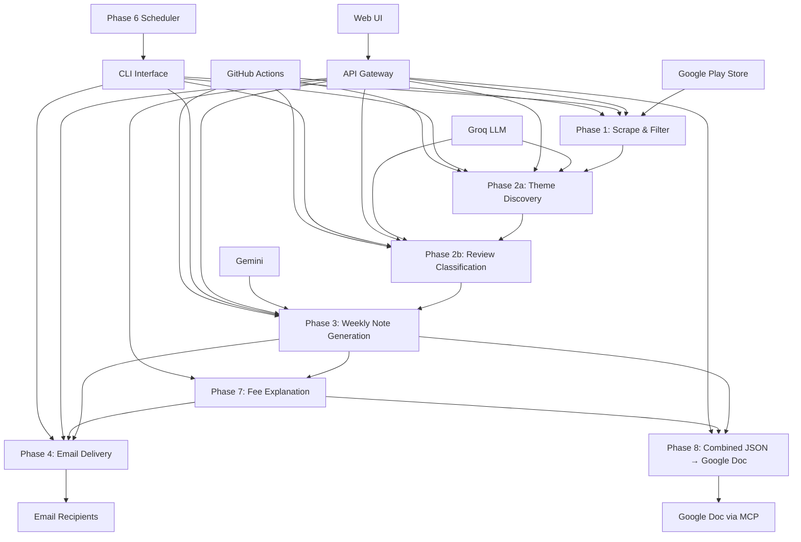
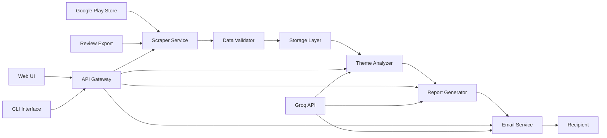
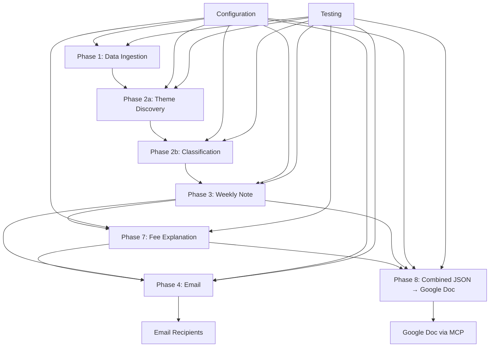

# App Review Insights Analyzer - Architecture Document

## Project Overview

Transform App Store/Play Store reviews into actionable weekly insights for product, growth, support, and leadership teams.

## Deployment & URLs


| Service               | URL                                                                                                            | Description                                                             |
| --------------------- | -------------------------------------------------------------------------------------------------------------- | ----------------------------------------------------------------------- |
| **Frontend (Vercel)** | [https://app-review-insights-analyser-dx6z.vercel.app](https://app-review-insights-analyser-dx6z.vercel.app)             | Web UI (View Report, Preview Email, Send Email)                         |
| **Backend (Render)**  | [https://app-review-insights-analyser.onrender.com](https://app-review-insights-analyser.onrender.com)         | FastAPI REST API (Docker)                                               |
| **API Base**          | [https://app-review-insights-analyser.onrender.com/api](https://app-review-insights-analyser.onrender.com/api) | REST endpoints (status, report, email preview/send)                     |
| **Resend**            | [https://resend.com](https://resend.com)                                                                       | Email delivery (API, used on Render free tier)                          |
| **GitHub Gist**       | [https://gist.github.com](https://gist.github.com)                                                             | Report storage for View Report on Render free tier                      |
| **Google Doc**        | [Combined Report Doc](https://docs.google.com/document/d/18QNI1O7hYnT4U8VtO7bfuvIIiD819I2tMVL8D2jL7H0/edit?tab=t.0) | Phase 8 MCP appends combined JSON (weekly pulse + fee)                  |
| **GitHub Actions**    | .github/workflows/weekly-pulse.yml                                                                             | Scheduler: Sunday 9:00 AM IST                                           |

**Hosting:** Backend on **Render.com** (Docker). Frontend on **Vercel**.

**Local:** [http://localhost:8000](http://localhost:8000) (Web UI + API via `python run_web.py`)

**Debug:** [https://app-review-insights-analyser.onrender.com/api/debug/fee](https://app-review-insights-analyser.onrender.com/api/debug/fee) — verify `FEE_EXPLANATION_URL` / `EXIT_LOAD_VALUE` on Render

## Tech Stack


| Layer              | Technology                                                                     |
| ------------------ | ------------------------------------------------------------------------------ |
| **Backend**        | Python 3.10/3.11, FastAPI, Uvicorn                                             |
| **Frontend**       | Static HTML/CSS/JS, vanilla JS (no framework)                                  |
| **AI/LLM**         | Groq (theme discovery, classification), Google Gemini (weekly note generation) |
| **Email**          | Resend API (Render) or SMTP (local); DOCX attachment (python-docx)             |
| **Scraping**       | google-play-scraper                                                            |
| **Hosting**        | Render.com (backend), Vercel (frontend)                                        |
| **Scheduler**      | GitHub Actions (cron: Sunday 9:00 AM IST)                                      |
| **Report Storage** | GitHub Gist (persistent, free; Render free tier has ephemeral disk)            |
| **MCP**            | Google Docs MCP — append Combined JSON (weekly pulse + fee explanation) to Google Doc |


### Problem Statement

Turn recent App Store/ Play Store reviews into a one-page weekly pulse containing:

- Top themes
- Real user quotes  
- Three action ideas
- Fee explanation (e.g. Mutual Fund Exit Load) with bullets and source links
- Draft email containing the weekly note
- Combined JSON appended to Google Doc via MCP

### Key Constraints

- Use google-play-scraper for downloading reviews and public exports
- Max 5 themes per report
- Keep notes scannable, ≤400 words (updated from 250)
- No PII (usernames/emails/IDs) in any artifacts
- Use Groq LLM for theme analysis and classification
- Use Gemini for weekly note generation
- Support both CLI and UI interfaces
- Focus on INDMoney app (in.indwealth)
- Reviews with fewer than 10 words are excluded
- Store only reviewId, rating, text, date (no title)

## Phase-wise Organization

The codebase is organized into separate phases for better maintainability and modularity:

### Phase 1: Data Ingestion (`phase1_Data_Ingestion/`)

- **Purpose**: Scrape and filter Google Play Store reviews for INDMoney
- **Key Components**:
  - `scraper_service.py`: Google Play Store integration
  - `data_ingestion.py`: Review data orchestration
  - `utils/validators.py`: PII filtering and review validation
  - `models/review.py`: Review data models
- **Output**: `data/reviews/YYYY-MM-DD.json` (filtered reviews)

#### Data Cleaning Rules:

- **PII Removal**: Emails, phone numbers, usernames, IDs, URLs
- **Content Filters**: 
  - Reviews with <10 words excluded
  - Non-English reviews excluded
  - **Emojis and star rating icons (⭐★☆) removed**
  - Reviews older than specified weeks excluded
- **Storage Format**: JSON with reviewId, rating, text, date fields only

### Phase 2a: Theme Discovery (`phase2a_Theme_Discovery/`)

- **Purpose**: Discover recurring themes from reviews using Groq LLM
- **Key Components**:
  - `groq_service.py`: Groq LLM integration
  - `theme_discovery.py`: Theme discovery orchestration
  - `models/theme.py`: Theme data models
  - `config/prompts.py`: LLM prompts for theme discovery
- **Output**: `data/reports/themes-YYYY-MM-DD.json` with discovered themes

### Phase 2b: Review Classification (`phase2b_Review_Classification/`)

- **Purpose**: Classify individual reviews into discovered themes
- **Key Components**:
  - `classification_service.py`: Groq classification service
  - `review_classification.py`: Classification orchestration
  - `models/classification.py`: Classification data models
  - `config/classification_prompts.py`: Classification prompts
- **Output**: `data/reports/grouped_reviews-YYYY-MM-DD.json` with classified reviews

### Phase 3: Weekly Note Generation (`phase3_Weekly_Note_Generation/`)

- **Purpose**: Generate actionable weekly insights using Gemini LLM
- **Key Components**:
  - `gemini_service.py`: Gemini LLM integration
  - `note_generation.py`: Weekly note orchestration
  - `models/note.py`: Weekly note data models
  - `config/prompts.py`: Weekly note generation prompts
- **Output**: 
  - `data/reports/pulse-YYYY-MM-DD.md` (Markdown format)
  - `data/reports/pulse-YYYY-MM-DD.txt` (Plain text format)
  - `data/reports/weekly_pulse-YYYY-MM-DD.json` (Structured data)

### Phase 4: Email Delivery (`phase4_Email_Delivery/`)

- **Purpose**: Deliver weekly insights via email with DOCX attachment (Resend API or SMTP)
- **Key Components**:
  - `email_service.py`: Resend API (Render) or SMTP (local) with attachment support
  - `email_delivery.py`: Email delivery orchestration; converts markdown to DOCX
  - `models/email.py`: Email data models and validation
  - `config/email_templates.py`: Email templates and HTML formatting
  - `drive_upload.py`: Optional Google Drive upload (not used in current flow; DOCX attached directly)
- **Attachments**: Weekly Note attached as `.docx` (python-docx); Resend and SMTP both support attachments
- **Output**:
  - `data/drafts/draft_YYYYMMDD_HHMMSS.eml` (Email drafts)
  - `data/deliveries/delivery_*.json` (Delivery records)
  - Sent emails via Resend (deployed) or SMTP (local) with DOCX attached
- **Consumes**: Phase 7 Fee Explanation output (section appended to email body)

### Phase 5: Orchestration & Web UI (`phase5_Orchestration_Web_UI/`)

- **Purpose**: Orchestrate the full pipeline (Phases 1–4, 7, 8), expose API for Web UI and CLI
- **Key Components**:
  - `pipeline.py`: End-to-end pipeline orchestration (invokes Phase 1 → 2a → 2b → 3 → 7 → 4 → 8 when Phase 7/8 are implemented)
  - `api.py`: FastAPI routes for Web UI
  - `static/`: Simple single-page web UI
- **Pipeline order (Web UI / CLI “Run Pipeline”)**: Phase 1 (scrape) → 2a (themes) → 2b (classify) → 3 (weekly note) → **Phase 7** (fee explanation) → Phase 4 (email, including fee section) → **Phase 8** (combined JSON → Google Doc via MCP). Phase 7 and 8 are optional (config or feature flags).
- **Interfaces**:
  - **CLI**: `main.py --phase run` (existing)
  - **Web UI**: Minimal single-page interface with essential actions only
  - **API**: REST endpoints for run, status, report, send-email

#### Phase 5 Minimal UI Specification

- **One page only** — no multi-page navigation
- **Essential actions**:
  1. **View Report** — Display latest weekly pulse from Gist (synced) or sample data (checkbox)
  2. **Preview Email** — HTML preview (respects "Use sample data" checkbox)
  3. **Send Email** — Send latest report via Resend (deployed) or SMTP (local); DOCX attachment
- **Checkbox:** "Use sample data" — when checked, View Report and Preview use sample_data; else last synced (Gist/local)
- **Status panel** — Reviews, Themes, Scheduler Run, Last Email Sent, Appended Doc (heading) with [Combined Report](https://docs.google.com/document/d/18QNI1O7hYnT4U8VtO7bfuvIIiD819I2tMVL8D2jL7H0/edit?tab=t.0) as hyperlink
- **Report preview** — Rendered markdown in a simple card
- **No** Run Pipeline (pipeline runs via GitHub Actions scheduler only). **No** analytics, scheduling, or config UI (use CLI / .env)

### Phase 6: Scheduler (`phase6_Scheduler/`)

- **Purpose**: Run weekly pulse automatically every Sunday at 9:00 AM IST — **fetch data only** (Phases 1–3). **Phase 4 (email), Phase 7 (Fee Explanation), and Phase 8 (Google Doc MCP) are not run** by the scheduler; email and fee/doc updates happen when the user runs the full pipeline from the Web UI or CLI.
- **Scope**: **100 reviews, 8 weeks** (no 5000-review runs)
- **Key Components**:
  - `scheduler.py`: Runs CLI `main.py --phase run --skip-email --weeks 8 --count 100` (Phases 1–3 only; no email, no Phase 7, no Phase 8)
  - `daemon.py`: APScheduler daemon (9:00 AM IST, Sundays)
  - `config.py`: `SCHEDULED_WEEKS=8`, `SCHEDULED_COUNT=100`
- **Integration**:
  - **CLI**: `python -m phase6_Scheduler.scheduler` (one-shot) or `python -m phase6_Scheduler.daemon` (long-running)
  - **GitHub Actions**: `.github/workflows/weekly-pulse.yml` — cron `30 3 * * 0` (3:30 AM UTC = 9 AM IST, Sundays)
- **Required Secrets** (GitHub): `GROQ_API_KEY`, `GEMINI_API_KEY` (no email secrets; email from UI)

### Phase 7: Fee Explanation (`phase7_Fee_Explanation/`) — run before or with Phase 4

- **Purpose**: Fetch exit load and fee details from a configurable URL and produce a short scenario title plus **three bullets** for the email and for the combined JSON.
- **Input**: Single configurable fee source URL via **`FEE_EXPLANATION_URL`** in `.env`. Example: `https://www.indmoney.com/mutual-funds/hdfc-mid-cap-fund-direct-plan-growth-option-3097`. The module fetches the page (or uses a dedicated API if available) and parses exit load and related fee information.
- **Key Components** (to implement):
  - `fee_fetcher.py`: HTTP fetch of URL; parse exit load and fee text from HTML (or API response)
  - `fee_formatter.py`: Turn raw fee data into exactly 3 `explanation_bullets` and `source_links`; set `last_checked`
  - `models/fee.py`: Data models for scenario, bullets, links
- **Output**: In-memory (and optionally `data/reports/fee_explanation-YYYY-MM-DD.json`) with:
  - `fee_scenario`: e.g. "Mutual Fund Exit Load"
  - `explanation_bullets`: array of **3** strings (factual bullets about exit load / fees)
  - `source_links`: array of URLs used
  - `last_checked`: date of fetch
- **Email usage**: The emailer receives this payload and appends to the body: **Fee Explanation: {fee_scenario}**, then Bullet 1, Bullet 2, Bullet 3.
- **Error handling**: If `FEE_EXPLANATION_URL` is not set or fetch/parse fails, the fee section is **omitted** from the email and combined JSON; pipeline continues. Log warning.
- **Config**: **`FEE_EXPLANATION_URL`** (optional). If unset, the fee explanation step is **skipped** and no fee section is added to email or combined JSON.
- **`EXIT_LOAD_VALUE`** (optional): When fetch fails (e.g. fund page blocked on Render), use this env value in the fallback fee section so the email/DOCX still show a value.
- **Implementation notes**: Fee section is included in both email body (HTML + plain text) and DOCX attachment. Token/URL values are sanitized (quotes stripped) for Render env. `GET /api/debug/fee` helps verify fee config at runtime.
- **Outputs feed**: Phase 4 (email body: fee scenario + bullets + source_links) and Phase 8 (combined JSON: fee_scenario, explanation_bullets, source_links, last_checked).

### Phase 8: Combined JSON → Google Doc (MCP) (`phase8_Combined_JSON_Google_Doc_MCP/`)

- **Purpose**: Build the combined JSON payload from the weekly pulse, fee scenario, and metadata, then append it to a Google Doc using MCP (Model Context Protocol) or Google Docs API fallback.
- **Input**: Phase 3 output (weekly_pulse: themes, quotes, action_ideas from `pulse-*.md` or `weekly_pulse-*.json`), Phase 7 output (`fee_scenario`, `explanation_bullets`, `source_links`, `last_checked` — or empty/default if Phase 7 skipped), and report date.
- **Combined JSON**: Assemble: `date`; `weekly_pulse.themes`, `weekly_pulse.quotes`, `weekly_pulse.action_ideas` (parsed from the pulse note or from grouped_reports + pulse content); `fee_scenario`, `explanation_bullets`, `source_links`, `last_checked` from the fee explanation step (or empty/default if skipped).
- **MCP integration**: The pipeline invokes an MCP server/tool (e.g. Google Docs MCP) to append this combined JSON—or a human-readable rendering of it—to a configured Google Doc. The MCP client runs in the same process or as a configured subprocess; credentials (e.g. Google service account or Auth) are provided via environment or MCP server config.
- **Optional persistence**: The combined JSON may be written to `data/reports/combined-YYYY-MM-DD.json` for audit or replay.
- **When skipped**: If **`GOOGLE_DOC_ID`** (or equivalent) is not set, or MCP is not configured, the append-to–Google-Doc step is skipped; pipeline still completes email and file outputs.
- **Config**: Google Doc identifier (e.g. **`GOOGLE_DOC_ID`** or doc URL), MCP server URL or command if required, and any credentials required by the MCP tool for Google Docs write access.
- **Output**: Google Doc (appended via MCP); optionally `data/reports/combined-YYYY-MM-DD.json` for audit.
- **Preview Email flow**: Clicking Preview Email triggers `POST /api/force-combined-report`; the combined report is appended to the Google Doc; UI shows "Appending to Google Doc…" then "Combined report appended successfully"; result written to `data/logs/mcp_last.json` for status tracking.
- **Key components**: `mcp_docs_client.py` (MCP + Docs API fallback), `production_google_docs_client.py` (credentials + Docs API), `combined_builder.py`, `docs/` (MCP verification notes).

### Benefits of Phase-wise Organization:

- **Modularity**: Each phase can be developed, tested, and maintained independently
- **Reusability**: Phase outputs can be used as inputs for multiple downstream processes
- **Scalability**: Individual phases can be scaled or optimized separately
- **Testing**: Each phase can be unit tested in isolation
- **Debugging**: Issues can be isolated to specific phases

### Implementation sequence (flow 1 → 8)

- **Phase numbering** in this document is **1, 2a, 2b, 3, 4, 5, 6, 7, 8** (for consistent naming and reading).
- **Pipeline execution order** when the user runs the full pipeline (Web UI or CLI “Run Pipeline”) is **not** 1→2→3→4→5→6→7→8. It is:

**Full pipeline execution order:**  
**1 → 2a → 2b → 3 → 7 → 4 → 8**

- Phase 5 is the **orchestrator**: it invokes the above sequence (1 → 2a → 2b → 3 → 7 → 4 → 8). Phase 5 does not “run” as a step in the middle; it runs the pipeline and serves the Web UI/API.
- Phase 6 is the **scheduler**: it runs only **1 → 2a → 2b → 3** (no 7, 4, or 8) on a schedule (e.g. Sunday 9 AM IST).

So the implementation sequence that matches runtime is: **1, 2a, 2b, 3, then 7 (fee), then 4 (email), then 8 (Google Doc)**. Phases 5 and 6 are the orchestration and scheduling layers.

### Phase Dependencies:

```
Phase 1 (Reviews) → Phase 2a (Themes) → Phase 2b (Classified Reviews) → Phase 3 (Weekly Notes)
                                                                  ↘
                                                           Phase 7 (Fee Explanation)
                                                                  ↘
                                                           Phase 4 (Email Delivery) → Email Recipients
                                                                  ↘
                                                           Phase 8 (Combined JSON → Google Doc via MCP)

Phase 5 (Orchestration + API + Web UI) invokes the pipeline in order: 1 → 2a → 2b → 3 → 7 → 4 → 8
Phase 6 (Scheduler) invokes CLI (Phases 1–3 only, --skip-email) at 9:00 AM IST weekly; GitHub Actions runs the same
```

- Phase 7 runs after Phase 3 (needs report date); its output feeds Phase 4 (email) and Phase 8.
- Phase 8 runs after Phase 3 and Phase 7; it writes to Google Doc via MCP.




## Phase-Wise Implementation

### Phase 1: Review Ingestion and Cleaning

**Objective**: Reliably get 8–12 weeks of Play Store reviews and store them in a PII-safe form

**Components**:

- Google Play Scraper Integration
- PII Filter Implementation
- Date Range Filtering
- Review Validation
- File Persistence

**Technical Stack**:

- Python 3.11+
- google-play-scraper for automated review collection
- JSON for storage
- Pydantic for data validation

**Configuration**:

- **Target App**: INDMoney
- **Package ID**: in.indwealth
- **Language**: lang="en", country="in"
- **Sort**: Sort.NEWEST, count=100 (scheduler), configurable via CLI `--count`
- **Weeks**: 8-12 (configurable)

**Key Features**:

- Fetch reviews using google-play-scraper
- Filter by date (keep only reviews >= today - weeks * 7 days)
- PII sanitization before storage
- Exclude reviews with fewer than 10 words
- Exclude reviews with emojis or non-English text
- Store only: reviewId, rating, text, date (no title)
- Write to data/reviews/YYYY-MM-DD.json format

**Output Format**:

```json
{
  "scrapedAt": "ISO8601",
  "packageId": "in.indwealth",
  "appId": "indmoney",
  "weeksRequested": 10,
  "reviews": [
    {
      "reviewId": "string",
      "rating": 1,
      "text": "string",
      "date": "ISO8601 datetime"
    }
  ]
}
```

**Downstream**: Phase 1 output is consumed by Phase 2a (theme discovery) and Phase 2b (classification). When the full pipeline is run from the Web UI or CLI, the flow continues through Phase 3 → 7 → 4 → 8; the scheduler (Phase 6) runs only Phases 1–3.

### Phase 2: Theme Discovery and Classification (Groq)

**Objective**: Produce 3–5 themes and assign every review to exactly one theme

**Components**:

- Theme Discovery Engine (2a)
- Review Classification Engine (2b)
- Batch Processing Logic
- Rate Limiting and Retry

**Technical Stack**:

- Groq Python SDK
- llama-3.3-70b-versatile model
- Async processing for batch operations
- JSON parsing and validation

#### Phase 2a: Theme Discovery

**Input**: Sample of 100-150 reviews, stratified by rating
**Prompt**: "You are a product analyst. Given these user reviews for the INDMoney app, identify exactly 3 to 5 recurring themes. Return ONLY a JSON array of theme objects: [{id: theme_slug, label: Human Label, description: one-line description}]."

**Output Format**:

```json
[
  {
    "id": "theme_slug",
    "label": "Human-Readable Theme Name",
    "description": "One-line description"
  }
]
```

#### Phase 2b: Review Classification

**Input**: Full list of reviews and theme list from 2a
**Batching**: Process reviews in chunks of ~50
**Prompt**: "Given these themes: {themes_json}. Classify each review below into exactly one theme. Return a JSON array: [{reviewId: ..., theme_id: ...}]. Reviews: {batch}."

**Output Format**:

```json
{
  "generatedAt": "ISO8601",
  "themes": [
    {"id": "theme_slug", "label": "Human Label", "description": "one-line description"}
  ],
  "byTheme": {
    "theme_slug_1": [
      {"reviewId": "...", "rating": 1, "text": "...", "date": "..."}
    ],
    "theme_slug_2": [...]
  }
}
```

**Rate Limiting**: 0.5s sleep between Groq calls; retry with backoff on HTTP 429

**Downstream**: Phase 2a/2b outputs (themes, grouped_reviews) feed Phase 3. Phase 3 output then feeds Phase 4 (email body/attachment), Phase 7 (report date context), and Phase 8 (themes/quotes/action_ideas in combined JSON).

### Phase 3: Weekly Note Generation (Gemini)

**Objective**: One-page, structured weekly pulse from grouped data

**Components**:

- Weekly Note Generator
- Quote Selection Algorithm
- Action Ideas Generator
- Content Validation

**Technical Stack**:

- Gemini API (gemini-1.5-flash)
- Markdown generation
- Text validation
- Substring verification

**Input**: grouped_reviews-*.json and report date
**Role**: "You are a product communications writer at INDMoney."
**Task**: "Using the themed review data below, write a concise Weekly Review Pulse note."

**Format**: Sections: Top Themes, Real User Quotes, Action Ideas
**Rules**: 

- No PII (use [User] for names)
- Quotes must be verbatim from provided reviews
- Under 400 words total
- Exactly 3 quotes (no star ratings or emoji in output, per PII/clean-output rules)
- Exactly 3 concrete, theme-linked actions

**Output Files**:

- data/reports/pulse-YYYY-MM-DD.md (Markdown)
- data/reports/pulse-YYYY-MM-DD.txt (Plain text)
- data/reports/weekly_pulse-YYYY-MM-DD.json (Structured; consumed by Phase 8 combined JSON)

**Downstream**: Phase 3 output is consumed by Phase 4 (email body and DOCX attachment), Phase 7 (report date for fee explanation), and Phase 8 (weekly_pulse in combined JSON → Google Doc).

**Structure**:

```markdown
## INDMoney Weekly Review Pulse -- Week of {date}

### Top Themes
[Top 3 themes with one-sentence summary and mention count]

### Real User Quotes
[Exactly 3 verbatim quotes, no star ratings]

### Action Ideas
[Exactly 3 concrete, theme-linked actions]
```

### Phase 4: Email Delivery

**Objective**: Produce a draft email (and optionally send it) containing the weekly note with DOCX attachment

**Components**:

- Email Service Integration (Resend API or SMTP)
- Template Engine (HTML + plain text)
- DOCX Attachment (python-docx; markdown → Word)
- Dry-run Mode

**Technical Stack**:

- Resend API (Render free tier; SMTP ports blocked)
- SMTP integration (smtplib) for local
- Markdown to HTML conversion
- Multipart email with DOCX attachment (base64 for Resend)
- TLS encryption (SMTP)

**Message Format**:

- **Subject**: INDMoney Weekly Review Pulse -- Week of {date}
- **From**: EMAIL_SENDER
- **To**: Runtime recipient or EMAIL_RECIPIENT
- **Body**: Multipart (plain + HTML); Weekly Note; Fee Explanation section
- **Attachment**: Weekly Note as `.docx` (INDMoney_Weekly_Pulse_*.docx)

**Fee Explanation (Email Section)** (content supplied by Phase 7):

- **Scenario title**: e.g. "Mutual Fund Exit Load"
- **Bullet points**: Fact-based explanation (Bullet 1, Bullet 2, Bullet 3, …)
- **Source links**: From Phase 7 (e.g. [HDFC Mid Cap Fund](https://www.indmoney.com/mutual-funds/hdfc-mid-cap-fund-direct-plan-growth-option-3097))
- See **Phase 7: Fee Explanation** for data source and implementation.

**Modes**:

- **Dry-run (default)**: Write to data/drafts/draft_*.eml
- **Send mode**: Send via Resend or SMTP with DOCX attached

**Configuration**:

- EMAIL_SENDER, EMAIL_RECIPIENT
- RESEND_API_KEY (Render); EMAIL_PASSWORD, SMTP_HOST, SMTP_PORT (local SMTP)

**Pipeline context**: Phase 4 runs after Phase 7 when the full pipeline is used; the orchestrator supplies Phase 7 fee data (bullets, source_links) for the email body. After Phase 4, Phase 8 runs (combined JSON → Google Doc via MCP) using the same weekly pulse and fee explanation data.

### Phase 5: Orchestration & Web UI (Implementation)

**Objective**: Run the full pipeline in order 1 → 2a → 2b → 3 → 7 → 4 → 8 and serve the Web UI/API.

**Pipeline behaviour**: Invoke Phase 7 (fee explanation) after Phase 3; pass fee output to Phase 4 for the email body and to Phase 8 for combined JSON. Invoke Phase 8 after Phase 4 to build combined JSON and append to Google Doc via MCP. **Config**: `FEE_EXPLANATION_URL` (optional)—if unset, Phase 7 is skipped and no fee section is added to email or combined JSON. `GOOGLE_DOC_ID` (optional)—if unset or MCP not configured, Phase 8 append is skipped; pipeline still completes.

### Phase 6: Scheduler (Implementation)

**Objective**: Run Phases 1–3 only on a schedule (e.g. Sunday 9:00 AM IST). **Phase 4 (email), Phase 7 (Fee Explanation), and Phase 8 (Google Doc MCP) are not run** by the scheduler; for those, the user runs the full pipeline from the Web UI or CLI. See **Phase 7** and **Phase 8** for when fee and Google Doc steps run.

### Phase 7: Fee Explanation (Implementation) — run before or with Phase 4

**Goal**: Fetch exit load and fee details from a configurable URL and produce a short scenario title plus three bullets for the email and for the combined JSON.

**Input**:

- **Configurable fee source URL**: `FEE_EXPLANATION_URL` in `.env`. Example: `https://www.indmoney.com/mutual-funds/hdfc-mid-cap-fund-direct-plan-growth-option-3097`. The module fetches the page (or uses a dedicated API if available) and parses exit load and related fee information.

**Output**: In-memory (and optionally `data/reports/fee_explanation-YYYY-MM-DD.json`) with:

- `fee_scenario`: e.g. "Mutual Fund Exit Load"
- `explanation_bullets`: array of **3** strings (factual bullets about exit load / fees)
- `source_links`: array of URLs used
- `last_checked`: date of fetch

**Email usage**: The emailer receives this payload and appends to the body:

- **Fee Explanation: {fee_scenario}**
- Bullet 1
- Bullet 2
- Bullet 3

**Error handling**: If `FEE_EXPLANATION_URL` is not set or fetch/parse fails, the fee section is **omitted** from the email and combined JSON; pipeline continues. Log warning.

**Config**: **`FEE_EXPLANATION_URL`** (optional). If unset, the fee explanation step is **skipped** and no fee section is added to email or combined JSON.

**Output (struct / JSON)**:

```json
{
  "fee_scenario": "Mutual Fund Exit Load",
  "explanation_bullets": ["Bullet 1", "Bullet 2", "Bullet 3"],
  "source_links": ["https://www.indmoney.com/mutual-funds/..."],
  "last_checked": "2026-03-15"
}
```

**Optional file**: `data/reports/fee_explanation-YYYY-MM-DD.json` for debugging and reuse by Phase 8.

---

### Phase 8: Combined JSON and Append to Google Doc via MCP (Implementation)

**Goal**: Build the combined JSON payload from the weekly pulse, fee scenario, and metadata, then append it to a Google Doc using MCP (Model Context Protocol).

**Input**:

- Latest pulse output (or parsed themes/quotes/action_ideas from `pulse-*.md`).
- Fee explanation output (`fee_scenario`, `explanation_bullets`, `source_links`, `last_checked`) — or empty/default if Phase 7 was skipped.
- Report date.

**Combined JSON**: Assemble the structure:

- `date`; `weekly_pulse.themes`, `weekly_pulse.quotes`, `weekly_pulse.action_ideas` (parsed from the pulse note or from grouped_reports + pulse content).
- `fee_scenario`, `explanation_bullets`, `source_links`, `last_checked` from the fee explanation step (or empty/default if skipped).

**Payload schema (Combined JSON)**:

```json
{
  "date": "2026-03-15",
  "weekly_pulse": {
    "themes": ["Theme 1", "Theme 2", "Theme 3"],
    "quotes": ["Quote 1", "Quote 2", "Quote 3"],
    "action_ideas": ["Action 1", "Action 2", "Action 3"]
  },
  "fee_scenario": "Mutual Fund Exit Load",
  "explanation_bullets": [
    "Fact 1...",
    "Fact 2...",
    "Fact 3..."
  ],
  "source_links": ["Link 1", "Link 2"],
  "last_checked": "2026-03-15"
}
```

**MCP integration**: The pipeline invokes an MCP server/tool (e.g. Google Docs MCP) to append this combined JSON—or a human-readable rendering of it—to a configured Google Doc. The MCP client runs in the same process or as a configured subprocess; credentials (e.g. Google service account or Auth) are provided via environment or MCP server config.

**Implementation**: Phase 8 tries **MCP first** when `MCP_GOOGLE_DOCS_USE_MCP=1` and `MCP_GOOGLE_DOCS_MCP_COMMAND` (and optional `MCP_GOOGLE_DOCS_MCP_ARGS`) are set; it spawns the MCP server (e.g. `google-docs-mcp-server`) and calls the `append_text` tool. If MCP is not configured or the call fails, it **falls back** to the Google Docs REST API using `GOOGLE_DRIVE_CREDENTIALS_*` and `GOOGLE_DOC_ID`.

**Optional persistence**: The combined JSON may be written to `data/reports/combined-YYYY-MM-DD.json` for audit or replay.

**When skipped**: If **`GOOGLE_DOC_ID`** (or equivalent) is not set, or MCP is not configured, the append-to–Google-Doc step is skipped; pipeline still completes email and file outputs.

**Config**: Google Doc identifier (e.g. **`GOOGLE_DOC_ID`** or doc URL), MCP server URL or command if required, and any credentials required by the MCP tool for Google Docs write access.

## Detailed System Architecture

### Data Flow Architecture



**Note**: When Phase 7 and Phase 8 are enabled, fee explanation data (Phase 7) flows into the email body (Phase 4) and into the combined JSON; Phase 8 appends that combined JSON to a Google Doc via MCP. See Phase Dependencies and Phase-Wise Implementation for the full sequence 1 → 2a → 2b → 3 → 7 → 4 → 8.


### Component Architecture

#### 1. Data Layer

```
app-review-insights-analyser/
├── phase1_Data_Ingestion/          # Phase 1: Review Ingestion & Cleaning
│   ├── __init__.py
│   ├── scraper_service.py           # Google Play Store scraper
│   ├── data_ingestion.py             # Data processing & storage
│   ├── models/
│   │   ├── __init__.py
│   │   └── review.py                 # Review data models
│   └── utils/
│       ├── __init__.py
│       └── validators.py            # Review validation & PII filtering
├── phase2a_Theme_Discovery/         # Phase 2a: Theme Discovery
│   ├── __init__.py
│   ├── groq_service.py               # Groq LLM integration
│   ├── theme_discovery.py            # Theme discovery orchestration
│   ├── models/
│   │   ├── __init__.py
│   │   └── theme.py                  # Theme data models
│   └── config/
│       ├── __init__.py
│       └── prompts.py                # LLM prompts
├── phase2b_Review_Classification/   # Phase 2b: Review Classification
│   ├── __init__.py
│   ├── classification_service.py     # Groq classification service
│   ├── review_classification.py      # Classification orchestration
│   ├── models/
│   │   ├── __init__.py
│   │   └── classification.py         # Classification data models
│   └── config/
│       ├── __init__.py
│       └── classification_prompts.py # Classification prompts
├── phase3_Weekly_Note_Generation/    # Phase 3: Weekly Note Generation
│   ├── __init__.py
│   ├── gemini_service.py             # Gemini LLM integration
│   ├── note_generation.py            # Weekly note orchestration
│   ├── models/
│   │   ├── __init__.py
│   │   └── note.py                   # Weekly note data models
│   └── config/
│       ├── __init__.py
│       └── prompts.py                # Weekly note generation prompts
├── phase4_Email_Delivery/           # Phase 4: Email Delivery
│   ├── __init__.py
│   ├── email_service.py             # Resend API or SMTP; DOCX attachment support
│   ├── email_delivery.py            # Email delivery; markdown→DOCX
│   ├── drive_upload.py              # Optional: Google Drive upload (unused in current flow)
│   ├── models/
│   │   ├── __init__.py
│   │   └── email.py                  # Email data models
│   ├── config/
│   │   ├── __init__.py
│   │   └── email_templates.py        # Email templates
│   └── templates/
│       └── __init__.py               # Email template files
├── phase5_Orchestration_Web_UI/      # Phase 5: Orchestration & Web UI
│   ├── __init__.py
│   ├── pipeline.py                  # Pipeline orchestration
│   ├── api.py                       # FastAPI REST API
│   └── static/
│       └── index.html               # Minimal Web UI (single page)
├── phase6_Scheduler/               # Phase 6: Scheduler
│   ├── __init__.py
│   ├── scheduler.py                 # One-shot or scheduled run (Phases 1–3 only)
│   ├── daemon.py                    # APScheduler daemon (Sundays 9 AM IST)
│   └── config.py                    # SCHEDULED_WEEKS, SCHEDULED_COUNT
├── phase7_Fee_Explanation/        # Phase 7: Fee Explanation (to implement)
│   ├── __init__.py
│   ├── fee_fetcher.py               # Fetch FEE_EXPLANATION_URL; parse exit load / fee details
│   ├── fee_formatter.py             # Build 3 explanation_bullets, source_links, last_checked
│   └── models/
│       └── fee.py                   # Fee scenario data models (config: FEE_EXPLANATION_URL in .env)
├── phase8_Combined_JSON_Google_Doc_MCP/  # Phase 8: Combined JSON → Google Doc (MCP, production_google_docs_client, docs)
│   ├── __init__.py
│   ├── combined_builder.py          # Build Combined JSON from Phase 3 + Phase 7
│   ├── mcp_docs_client.py           # MCP client to append to Google Doc
│   └── models/
│       └── combined_report.py      # Combined JSON schema (config: GOOGLE_DOC_ID, MCP server/creds)
├── src/                             # Shared components
│   └── config/
│       └── settings.py              # Configuration management
├── data/                            # Data storage
│   ├── reviews/                     # Raw reviews (Phase 1 output)
│   ├── reports/                     # Generated reports
│   │   ├── themes-*.json           # Discovered themes (Phase 2a)
│   │   ├── grouped_reviews-*.json # Classified reviews (Phase 2b)
│   │   ├── pulse-*.md              # Weekly notes (Phase 3, Markdown)
│   │   ├── pulse-*.txt              # Weekly notes (Phase 3, Plain text)
│   │   ├── weekly_pulse-*.json     # Weekly notes (Phase 3, Structured)
│   │   ├── fee_explanation-*.json  # Fee explanation (Phase 7, optional)
│   │   └── combined-*.json         # Combined JSON (Phase 8, optional)
│   ├── drafts/                      # Email drafts (Phase 4)
│   ├── deliveries/                  # Email delivery records (Phase 4)
│   └── logs/                        # Application logs
├── main.py                          # CLI entry point
├── requirements.txt                # Python dependencies
├── .env.example                     # Environment variables template
├── docs/                            # Documentation
│   ├── DEPLOYMENT.md               # Render + Vercel deployment
│   ├── LOCAL_RUN.md                # Local development
│   └── MCP_GOOGLE_DOCS_SETUP.md    # Phase 8 MCP setup
└── ARCHITECTURE.md                  # This document
```

#### 2. Service Layer

```
src/
├── services/
│   ├── scraper_service.py      # Google Play scraper
│   ├── data_ingestion.py
│   ├── theme_analysis.py
│   ├── report_generation.py
│   ├── email_service.py
│   └── api_service.py          # FastAPI endpoints
├── ui/
│   ├── frontend/               # React.js application
│   │   ├── components/
│   │   ├── pages/
│   │   └── services/
│   └── static/
├── models/
│   ├── review.py
│   ├── theme.py
│   └── report.py
├── utils/
│   ├── validators.py
│   ├── formatters.py
│   └── pii_detector.py
├── cli/
│   └── commands.py            # CLI interface
└── config/
    ├── settings.py
    └── prompts.py
```

#### 3. Configuration Layer

```
config/
├── app_config.yaml
├── llm_prompts.yaml
├── email_templates.yaml
└── scraper_config.yaml      # Google Play scraper settings
```

#### 4. UI Layer

```
frontend/
├── src/
│   ├── components/
│   │   ├── Dashboard.jsx      # Main dashboard
│   │   ├── ReportGenerator.jsx # Report generation UI
│   │   ├── EmailComposer.jsx   # Email drafting UI
│   │   └── Settings.jsx        # Configuration UI
│   ├── pages/
│   │   ├── Home.jsx
│   │   ├── Reports.jsx        # Historical reports
│   │   └── Analytics.jsx      # Review analytics
│   ├── services/
│   │   └── api.js             # API client
│   └── utils/
├── public/
└── package.json
```

## Data Models and File Formats

### Review Record (Internal)

```json
{
  "reviewId": "string",
  "rating": 1,
  "text": "string",
  "date": "ISO8601 datetime"
}
```

- **reviewId**: From Play Store (used for deduplication and classification)
- **date**: Review's published date (used to restrict to 8-12 weeks)
- **text**: PII-sanitized review text
- **Exclusions**: Reviews with <10 words, with emoji, or non-English

### Reviews File (Phase 1 Output)

**Path**: data/reviews/YYYY-MM-DD.json

```json
{
  "scrapedAt": "ISO8601",
  "packageId": "in.indwealth",
  "appId": "indmoney",
  "weeksRequested": 10,
  "reviews": [
    {"reviewId", "rating", "text", "date"}
  ]
}
```

### Themes (Phase 2a Output)

```json
[
  {
    "id": "theme_slug",
    "label": "Human-Readable Theme Name",
    "description": "One-line description"
  }
]
```

- Exactly 3-5 themes per run
- **id**: machine-friendly slug for classification

### Grouped Reviews (Phase 2b Output)

**Path**: data/reports/grouped_reviews-YYYY-MM-DD.json

```json
{
  "generatedAt": "ISO8601",
  "appId": "indmoney",
  "packageId": "in.indwealth",
  "themes": [
    {"id", "label", "description"}
  ],
  "byTheme": {
    "theme_slug_1": [
      {"reviewId", "rating", "text", "date"}
    ],
    "theme_slug_2": [...]
  }
}
```

### Weekly Pulse Note (Phase 3 Output)

**Paths**: 

- data/reports/pulse-YYYY-MM-DD.md
- data/reports/pulse-YYYY-MM-DD.txt

**Structure**:

```markdown
## INDMoney Weekly Review Pulse -- Week of {date}

### Top Themes
Top 3 themes with one-sentence summary and mention count

### Real User Quotes
Exactly 3 verbatim quotes (with star rating); no PII

### Action Ideas
Exactly 3 concrete, theme-linked actions
```

- **Length**: Under 400 words
- **Quotes**: Must exist in provided reviews; no fabrication

### Theme Model

```python
class Theme:
    id: str                   # Theme identifier
    name: str                 # Theme name
    description: str          # Theme description
    review_count: int         # Number of reviews
    confidence_score: float   # AI confidence
    created_at: datetime      # Generation timestamp
```

### Report Model

```python
class WeeklyReport:
    id: str                   # Report identifier
    week_start: date          # Week start date
    week_end: date            # Week end date
    themes: List[Theme]       # Top 3 themes
    quotes: List[str]          # User quotes
    actions: List[str]         # Action ideas
    word_count: int           # Total words
    generated_at: datetime     # Generation timestamp
```

## LLM Integration Strategy

### hiGroq API Usage

#### Theme Generation Prompt

```
Analyze these app reviews and generate 3-5 key themes.
Requirements:
- Maximum 5 themes
- Each theme should be actionable
- Group similar feedback together
- Focus on user pain points and feature requests

Reviews: {reviews_text}

Output format:
Theme 1: [Name] - [Description]
Theme 2: [Name] - [Description]
...
```

#### Review Classification Prompt

```
You are a product analyst. Given this user review for the {app_name} app and the available themes, classify which theme best matches this review.

Available Themes:
{themes_list}

Review to classify:
Rating: {rating}/5
Text: "{review_text}"

Return ONLY a JSON object with the theme ID and confidence score:
{"themeId": "theme_slug", "confidence": 0.85}
```

#### Quote Selection Prompt

```
Select 3 representative user quotes from these reviews.
Requirements:
- No PII (remove usernames, emails, IDs)
- Maximum 50 words per quote
- Must represent different themes
- Should be impactful and clear

Reviews by theme: {grouped_reviews}

Output format:
Quote 1: [Quote text]
Quote 2: [Quote text]
Quote 3: [Quote text]
```

#### Action Ideas Prompt

```
Generate 3 actionable improvement ideas based on these themes.
Requirements:
- Specific and measurable actions
- Prioritized by impact
- Feasible for development team
- Maximum 30 words per action

Themes: {themes_summary}

Output format:
Action 1: [Action description]
Action 2: [Action description]
Action 3: [Action description]
```

## Security & Privacy Considerations

### PII Detection and Removal

- Regex patterns for emails, usernames, IDs
- LLM-based PII detection
- Manual review process for sensitive data
- Data anonymization pipeline

### Data Security

- Environment variables for API keys
- Encrypted storage for sensitive data
- Access logging and monitoring
- Regular security audits

## Performance Considerations

### Scalability

- Batch processing for large review volumes
- Async LLM calls for parallel processing
- Caching for theme analysis results
- Database indexing for efficient queries

### Optimization

- Rate limiting for Groq API calls
- Memory-efficient data processing
- Lazy loading for large datasets
- Background job processing

## Monitoring & Logging

### Metrics to Track

- Review processing volume
- Theme generation accuracy
- Report generation time
- Email delivery rates
- API usage and costs

### Logging Strategy

- Structured logging with JSON format
- Different log levels for debugging
- Error tracking and alerting
- Performance monitoring

## UI Architecture

### Web Interface Components

#### Dashboard

- **Overview**: Recent review statistics and trends
- **Quick Actions**: Generate report, send email, scrape reviews
- **Status Indicators**: Processing status, API health

#### Report Generator

- **Date Range Selection**: Configure 8-12 week analysis period
- **App Selection**: Choose apps to analyze
- **Theme Configuration**: Adjust theme generation parameters
- **Real-time Preview**: Live report generation updates

#### Email Composer

- **Template Selection**: Choose email templates
- **Recipient Management**: Configure delivery settings
- **Preview Mode**: Review email before sending
- **Schedule Options**: Set delivery timing

#### Analytics View

- **Review Trends**: Visual representation of review patterns
- **Theme Evolution**: Track theme changes over time
- **Sentiment Analysis**: Mood and satisfaction metrics
- **Export Options**: Download reports in various formats

### API Endpoints (Phase 5)

| Method | Endpoint | Description |
|--------|----------|-------------|
| `GET` | `/` | Web UI (HTML) |
| `GET` | `/api/health` | Health check (no deps) |
| `GET` | `/api/status` | Pipeline status (reviews, themes, Scheduler Run, Last Email Sent, Appended Doc) |
| `GET` | `/api/report` | Latest weekly pulse (markdown; `?sample=1` for sample data) |
| `GET` | `/api/email/preview` | Email preview HTML (`?sample=1` for sample data) |
| `POST` | `/api/email/send` | Send latest report via Resend/SMTP (DOCX attached) |
| `GET` | `/api/email/send-status` | Poll send result after `POST /api/email/send` |
| `POST` | `/api/force-combined-report` | Append combined report to Google Doc (triggered by Preview Email; `?sample=1` for sample) |
| `POST` | `/api/upload/sync` | Scheduler upload (report to backend; `X-Upload-Secret` required) |
| `GET` | `/api/debug/fee` | Debug fee config (`fee_url_configured`, `fee_fetch_ok`, etc.) |

## CLI Interface

### Entry Point

```bash
python main.py [options]
```

### Options

```bash
--phase {scrape|analyze|classify|report|email|all}  # Run specific phase or all
--weeks N                                           # Review window (default: 8, allow 8-12)
--send                                              # Send email via SMTP in Phase 4
--skip-email                                        # Skip Phase 4 (scheduler: fetch only; email from UI)
--recipient EMAIL                                   # Override EMAIL_RECIPIENT
--recipient-name NAME                               # Personalized greeting
--date YYYY-MM-DD                                   # Report date (default: today)
```

### Phase Order (Full Pipeline)

**Full pipeline (Web UI or CLI “Run Pipeline”)**: 1 → 2a → 2b → 3 → 7 → 4 → 8  
**Scheduler / GitHub Actions**: 1 → 2a → 2b → 3 only (no Phase 7, 4, or 8).

### Usage Examples

```bash
# Run full pipeline (1 → 2a → 2b → 3 → 7 → 4 → 8 when Phase 7/8 config is set)
python main.py --phase all --weeks 10

# Generate and send email (includes Phase 7 fee section if FEE_EXPLANATION_URL set)
python main.py --phase all --send --recipient team@company.com

# With FEE_EXPLANATION_URL and GOOGLE_DOC_ID set, the same commands run Phase 7 (fee) and Phase 8 (Google Doc append) as well.

# Custom cron example
0 9 * * 1 cd /path/to/project && python main.py --phase all --weeks 10 --send
```

## Scheduler (Local)

### Entry Point

```bash
python -m phase6_Scheduler.scheduler  # one-shot
python -m phase6_Scheduler.daemon    # long-running, Sundays 9 AM IST
```

### Behavior

- **Runs every**: Sunday at 9:00 AM IST
- **Configuration**: 8 weeks, 100 reviews (not 5000)
- **Phases run**: 1–3 only (scrape, themes, classify, weekly note). Phase 4 (email), Phase 7 (Fee Explanation), and Phase 8 (Google Doc MCP) are not run; use Web UI or CLI for full pipeline.
- **Logs**: data/logs/scheduler.log

### Configuration (.env)

```bash
# App Configuration
INDMONEY_PACKAGE_ID=in.indwealth
INDMONEY_APP_NAME=INDMoney

# Scheduler (Phase 6) — configured in phase6_Scheduler/config.py
# SCHEDULED_RECIPIENT=ashishmyweb@gmail.com
# SCHEDULED_WEEKS=8, SCHEDULED_COUNT=100
```

### Deployment

- Run as long-lived process (systemd service or Docker)
- Uses same phase modules as CLI (no subprocess)
- Blocks and fires job every N minutes

## GitHub Actions (Scheduled Run)

### Workflow File

`.github/workflows/weekly-pulse.yml`

### Triggers

- **Schedule**: Every Sunday at 9:00 AM IST (3:30 AM UTC)
- **Manual**: workflow_dispatch from Actions tab (optional: use sample data)

### Behavior

- **Fetch data only** — Phases 1–3. Phase 4 (email), Phase 7 (Fee Explanation), and Phase 8 (Google Doc MCP) are not run. Email and fee/doc updates are done from the Web UI or CLI.

```bash
python main.py --phase run --skip-email --weeks 8 --count 100
```

### Required Secrets (GitHub → Settings → Secrets → Actions)


| Secret                 | Purpose                                                                                    |
| ---------------------- | ------------------------------------------------------------------------------------------ |
| `GROQ_API_KEY`         | Phase 2 (theme discovery, classification)                                                  |
| `GEMINI_API_KEY`       | Phase 3 (weekly note generation)                                                           |
| `GH_GIST_TOKEN`        | PAT with `gist` scope — uploads report to Gist (GITHUB_TOKEN cannot create Gists)          |
| `REPORT_GIST_ID`       | Gist ID for report storage (auto-created on first run, then add to secrets)                |
| `RENDER_URL`           | Backend URL for optional upload (e.g. `https://app-review-insights-analyser.onrender.com`) |
| `REPORT_UPLOAD_SECRET` | Must match Render's env (optional; Gist is primary on free tier)                           |


### Gist Storage (View Report on Render Free Tier)

- Render free tier has **ephemeral storage** — uploads are lost on restart
- **GitHub Gist** stores the report persistently (free)
- After scheduler run: `scripts/upload_sync.py` uploads `pulse.md` + `meta.json` to Gist
- Backend fetches from Gist when `REPORT_GIST_ID` is set in Render env
- See [docs/DEPLOYMENT.md](docs/DEPLOYMENT.md) §7 for setup
- **Gist 401 handling**: `GH_GIST_TOKEN` is sanitized (quotes/stray whitespace stripped). On 401 Unauthorized, the backend retries without auth (public Gists work unauthenticated). Use a **classic PAT** with `gist` scope (not fine-grained) for private Gists.

### Phase 7 & 8 configuration (optional)

| Variable               | Purpose                                                                 |
| ---------------------- | ----------------------------------------------------------------------- |
| `FEE_EXPLANATION_URL`  | Fee source URL (e.g. INDMoney fund page). If unset, fee step is skipped. |
| `GOOGLE_DOC_ID`        | Target Google Doc for MCP append. If unset or MCP not configured, append step is skipped. |

MCP server URL/command and credentials for Google Docs write are configured per MCP server (e.g. in Cursor or backend env).

## Web UI as Trigger

### Flow

1. User sets weeks (8-12) and email preference
2. UI calls POST /api/run
3. Backend runs full pipeline (Phases 1–4 and, when implemented, Phase 7 Fee Explanation and Phase 8 Combined JSON → Google Doc) via shared Python modules
4. UI shows rendered one-pager and offers download
5. Confirms email sent if chosen

### Benefits

- One pipeline, two entry points
- CLI for scripting/cron
- Web UI for interactive trigger and viewing

## Phase Dependencies




## Implementation Timeline

### Phase 1: 2-3 weeks

- Week 1: Google Play scraper integration and PII filtering
- Week 2: Date filtering and JSON file format implementation
- Week 3: CLI interface and error handling

### Phase 2: 2-3 weeks

- Week 1: Groq integration and theme discovery prompts
- Week 2: Review classification with batching and rate limiting
- Week 3: JSON output format and validation

### Phase 3: 2 weeks

- Week 1: Gemini integration and weekly note generation
- Week 2: Quote verification and action ideas generation

### Phase 4: 2-3 weeks

- Week 1: Email service integration and dry-run mode
- Week 2: SMTP configuration and send mode
- Week 3: DOCX attachment, Resend API, email templates

### Phase 5: 1-2 weeks

- Week 1: Pipeline orchestration, FastAPI routes, Web UI (Run Pipeline, View Report, Send Email)
- Week 2: Status API, Gist integration for View Report, CORS and deployment wiring

### Phase 6: 1 week

- Scheduler module (phase6_Scheduler/), one-shot and daemon modes
- GitHub Actions workflow (weekly-pulse.yml), cron 9:00 AM IST Sundays
- Upload to Gist after run; Phases 1–3 only (no email from scheduler)

### Phase 7: 1-2 weeks

- Week 1: Fee explanation fetcher (FEE_EXPLANATION_URL), HTML parse for exit load / fee details
- Week 2: Formatter (3 bullets, source_links, last_checked), integration with Phase 4 email and Phase 8 combined JSON; error handling when URL unset or fetch fails

### Phase 8: 1-2 weeks

- Week 1: Combined JSON builder (weekly_pulse from Phase 3 + fee data from Phase 7), Pydantic schema, optional file output (combined-*.json)
- Week 2: MCP client for Google Docs, append combined JSON or human-readable content; GOOGLE_DOC_ID config; skip append when unset or MCP not configured

### Additional Components

- Testing, documentation, and deployment (cross-cutting)

## Success Criteria

### Functional Requirements

- ✅ Process 8-12 weeks of review data
- ✅ Focus on INDMoney app (in.indwealth)
- ✅ Scrape Google Play Store reviews automatically
- ✅ Generate exactly 3-5 themes per report
- ✅ Create ≤400 word weekly reports (updated from 250)
- ✅ Use Groq for theme analysis and classification
- ✅ Use Gemini for weekly note generation
- ✅ Deliver automated email drafts
- ✅ Maintain PII-free output
- ✅ Support both CLI and web UI interfaces
- ✅ Include scheduler for automated runs
- ✅ Support GitHub Actions for CI/CD
- ✅ Exclude reviews with <10 words or emojis and star rating icons
- ✅ Store only reviewId, rating, text, date (no title)
- ✅ Verifiable quotes from source reviews
- ✅ INDMoney-specific report generation and email subject lines

### Non-Functional Requirements

- ✅ Process 100 reviews (8 weeks) for weekly pulse
- ✅ Generate reports in <5 minutes
- ✅ Maintain 99%+ uptime
- ✅ Keep API costs under budget
- ✅ Ensure data security and privacy

## Future Enhancements

### Advanced Features

- Multi-app support
- Sentiment analysis trends
- Competitive analysis
- Integration with project management tools
- Real-time review monitoring
- Mobile-responsive web interface
- Advanced analytics dashboard
- Custom report templates
- Team collaboration features
- API rate limiting and throttling

### Scalability Improvements

- Microservices architecture
- Database clustering
- CDN for static assets
- Advanced caching strategies
- Auto-scaling infrastructure


